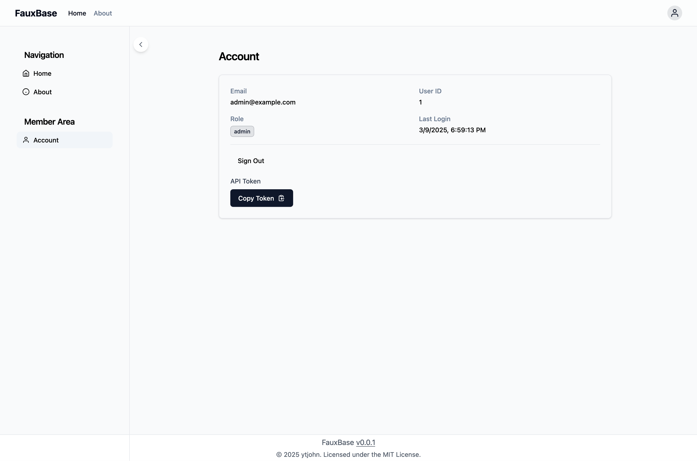

# FauxBase

**FauxBase** is a minimal yet functional Go starter codebase. It provides just enough tooling to get started quickly without unnecessary bloat. Think of it as a foundation for projects that need structure but not over-engineering.

## Quick Start

```bash
# Build the application
make build

# Initialize the database
bin/fauxbase db init

# Start the server
bin/fauxbase serve
```

Visit [http://localhost:8080](http://localhost:8080) to access the application.


## Screenshots

### Login Page


### Authenticated User


### About Page


### API Whoami with Auth


### API Version Info


## Requirements

You'll need Go 1.23 or higher to compile it.

## Database Setup

FauxBase supports SQLite and PostgreSQL for data storage. The database schema is embedded in the binary and can be initialized with:

```bash
# Initialize database (creates data/devdatabase.db by default)
fauxbase db init
```

The database location can be configured with the `FAUXBASE_DATABASE_PATH` environment variable:

```bash
FAUXBASE_DATABASE_PATH=/custom/path/db.sqlite fauxbase db init
```

## Running the Server

Start the server with embedded web content:

```bash
fauxbase serve
```

For development, use the local web directory:

```bash
fauxbase serve --webdir pkg/server/web
```

The server supports the following environment variables:

- `FAUXBASE_SERVER_PORT`: Server port (default: 8080)
- `FAUXBASE_SERVER_HOST`: Server host (default: 127.0.0.1)
- `FAUXBASE_DEBUG`: Enable debug logging (default: false)

Example with environment variables:

```bash
FAUXBASE_SERVER_PORT=9000 FAUXBASE_SERVER_HOST=0.0.0.0 FAUXBASE_DEBUG=true fauxbase serve
```

## Development

### Web Server Architecture

The server architecture consists of three main components:

1. **Go Server**: Uses [huma.rocks](https://huma.rocks) as the API framework, which automatically generates OpenAPI documentation. Access the API docs UI at [http://localhost:8080/api/v1/docs](http://localhost:8080/api/v1/docs).

2. **Middleware**: Located in `pkg/server/middleware`, handles cross-cutting concerns like logging and authentication.

3. **Frontend**: A modern web application using:

   - HTMX for dynamic content loading
   - Alpine.js for reactive components
   - Tailwind CSS with shadcn/ui-inspired components

### Frontend Organization

- `pkg/server/web/`
  - `css/`: Stylesheets including Tailwind configuration
  - `js/`: JavaScript modules
    - `auth.js`: Authentication service
    - `components.js`: Alpine.js components
    - `router.js`: Client-side routing
  - `templates/`
    - `pages/`: Page templates (home.html, about.html, etc.)
    - `partials/`: Reusable components (header.html, sidebar.html, etc.)

### Template Routing

The frontend uses a file-based routing system where URLs map to template files in `templates/pages/`. For example:

```javascript
const templatePath = `/templates/pages${path === '/' ? '/home' : path}.html`;
```

The index.html serves as the application shell, using HTMX to dynamically load content:

```html
<!-- Header partial -->
<div hx-get="/templates/partials/header.html" 
     hx-trigger="load, auth:changed from:body"
     hx-swap="innerHTML"></div>

<!-- Sidebar partial -->
<div hx-get="/templates/partials/sidebar.html" 
     hx-trigger="load, auth:changed from:body"
     hx-swap="innerHTML"></div>

<!-- Main content area -->
<div id="content">
    <!-- Page templates are loaded here -->
</div>
```

This structure allows for:

- Dynamic partial loading with HTMX
- Automatic auth state updates via custom events
- Clean separation of layout components
- Easy addition of new pages by adding templates

## API Endpoints

The following REST endpoints are available under `/api/v1/`:

### System Information

- `GET /api/v1/version`
  ```json
  {
    "version": "v0.0.1",
    "buildTime": "2024-03-09T00:00:00Z",
    "gitCommit": "abc123",
    "goVersion": "go1.23"
  }
  ```
  Returns build and version information.

All API endpoints return JSON and follow standard HTTP status codes.

## Why FauxBase?

Unlike full-fledged frameworks, FauxBase doesn’t impose structure—it gives you a solid foundation to build on without unnecessary complexity. **It’s the perfect mix of “fake” and functional.**

## License

MIT License. Feel free to use, modify, and contribute!

